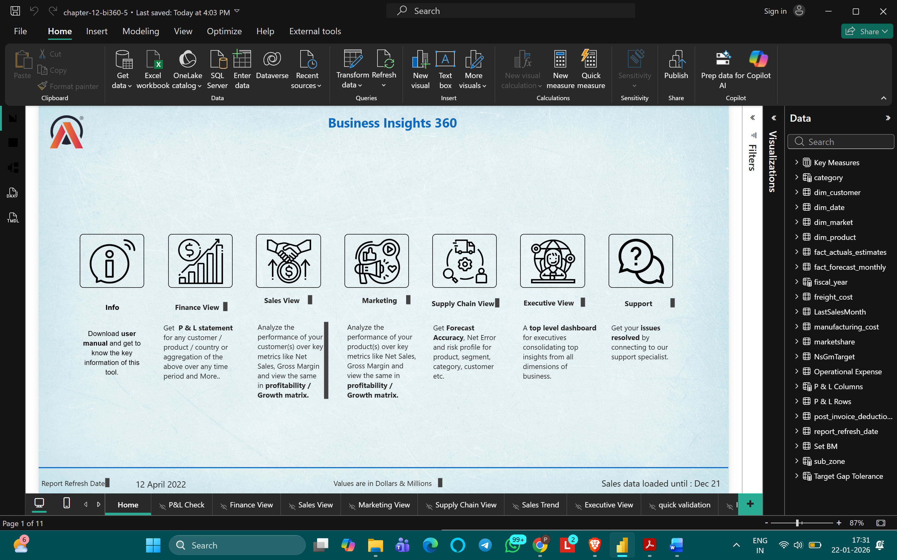
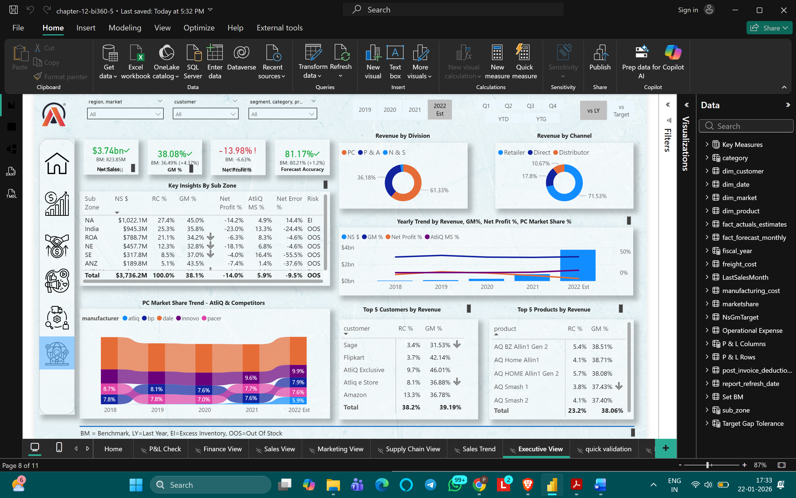
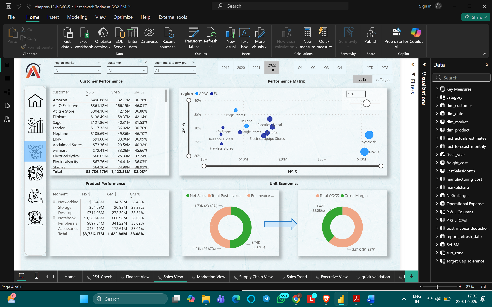
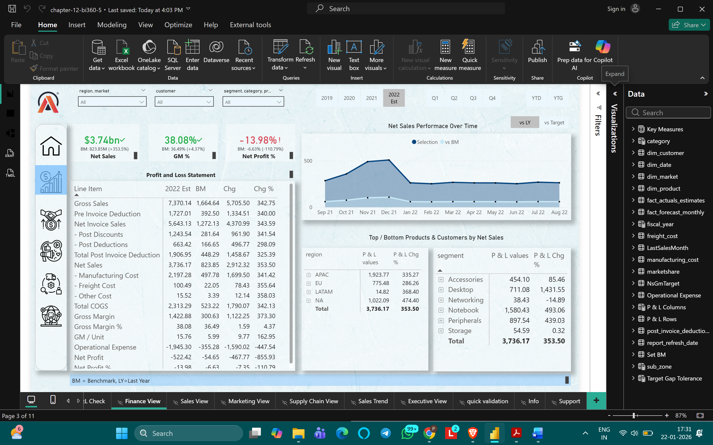
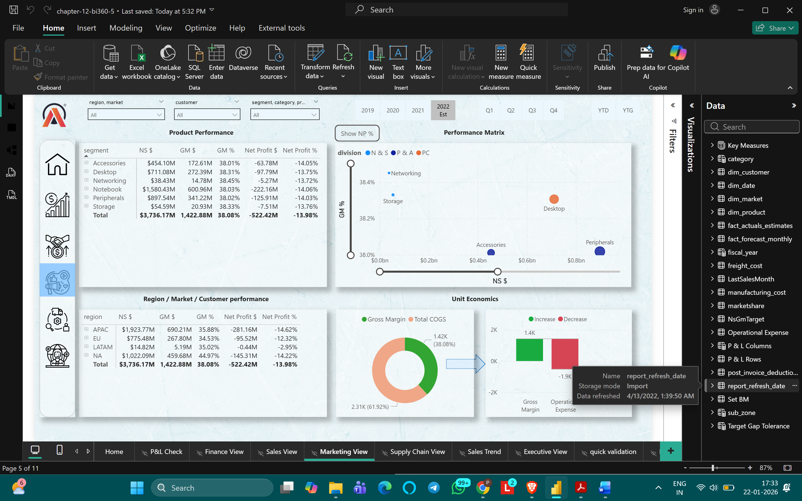
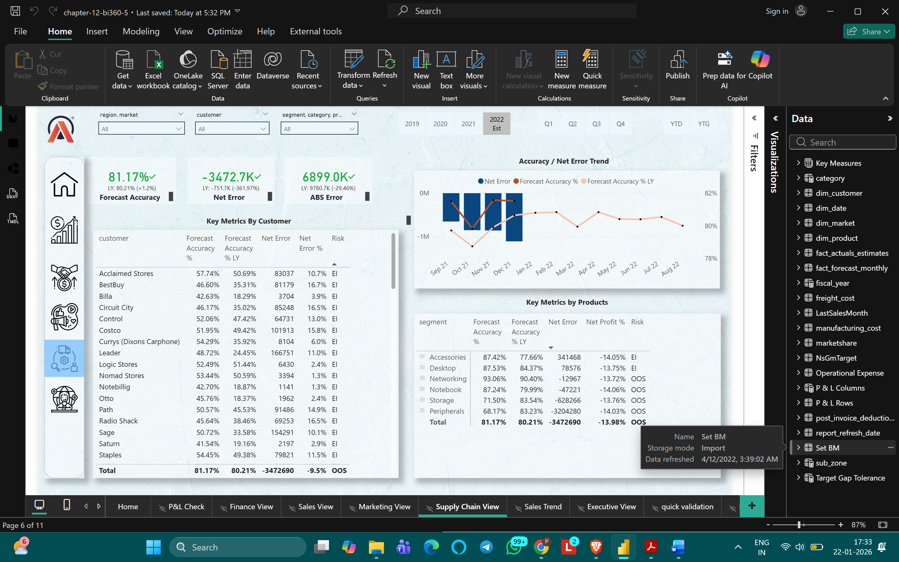
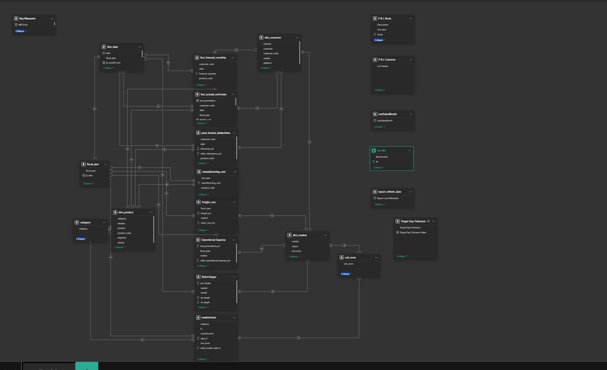

# Business-Insights-360-PowerBI
# Business Insights 360 – Power BI Dashboard

## 📌 Overview
Business Insights 360 is an **enterprise-level Business Intelligence solution** built using **Power BI**, providing **360° visibility into sales, finance, marketing, and supply chain performance** for a manufacturing organization.

This project simulates a **real-world corporate BI environment**, focusing on executive reporting and data-driven decision-making.

---

## 🏭 Industry
Manufacturing / Consumer Electronics

---

## 🎯 Business Objectives
- Track overall business performance using key financial and operational KPIs  
- Analyze **sales, profitability, forecast accuracy, and market share**  
- Identify underperforming regions, customers, and product segments  
- Enable self-service analytics for leadership and business teams  

---

## 📊 Key Dashboards

### 🏠 Home & Navigation

---

### 📈 Executive View

---

### 🛒 Sales View

---

### 💰 Finance (P&L) View

---

### 📢 Marketing View

---

### 🚚 Supply Chain View

---

### 🧩 Data Model

---

## 📈 Key Metrics Tracked
- **Net Sales:** $3.74B+
- **Gross Margin:** 38.08%
- **Net Profit:** -13.98%
- **Forecast Accuracy:** 81.17%
- **Net Error:** -3.47M
- Customer, product, market, and region-level KPIs

---

## 🧠 Data Modeling
- Implemented a **star schema** design
- Multiple fact tables (sales, forecast, costs)
- Dimension tables (date, customer, product, market)
- Optimized relationships for scalable analytics

---

## 🛠 Tools & Technologies
- Power BI Desktop  
- DAX (Time Intelligence, KPIs)  
- Power Query (ETL)  
- Data Modeling (Star Schema)  

---

## 🌐 Portfolio
👉 **Portfolio Website:** *To be added*

---

## 🚀 Key Learnings
- Designing enterprise-grade BI dashboards  
- Translating business problems into KPIs  
- Financial and supply chain analytics  
- Executive-level data storytelling  

---

## 👤 Author
**Piyush Sonawane**  
Data Analyst | Power BI | SQL | Python  

🔗 LinkedIn: https://www.linkedin.com/in/piyush-sonawane-005422257/  
🔗 GitHub: https://github.com/2Piyush0
🔗 Portfolio: https://codebasics.io/portfolio/Piyush-Sonawane

---

## 📌 Disclaimer
This project is created for **learning and portfolio purposes** and uses simulated business data.
